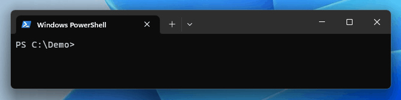
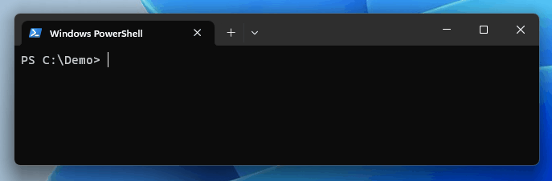
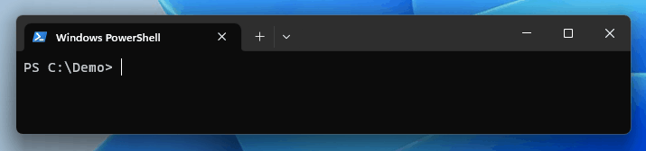
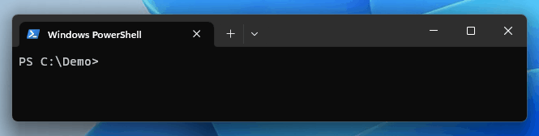
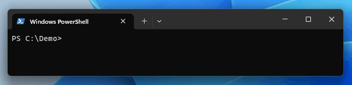
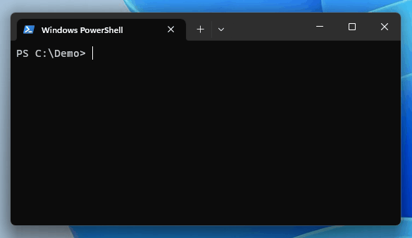
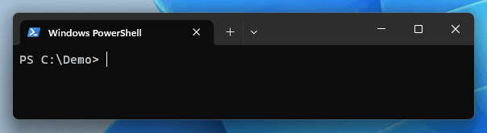

# AutoTyper

AutoTyper is a command-line tool designed to simulate user input in a terminal. It can be particularly useful for testing command-line applications, creating command-line application demos, or automating command input sequences.


## Features

- Simulate user input in a terminal environment.
- Customizable delay between characters and before/after commands.
- Support for various shell prompts: bash, cmd, or ps.
- Optional clearing of the screen between commands.
- Configure the username, hostname, and path in the prompt.

## Installation

You can install AutoTyper by downloading the appropriate archive (zip or tgz) from the [Releases page](https://github.com/bitcanon/autotyper/releases) and placing the executable binary anywhere in your PATH.

## Usage

To use AutoTyper, you can run it with the following command:

```shell
autotyper [flags] <command>
```

### Input File

In the following examples (and the GIF above) we will use the following `commands.txt` file:

```shell
mactool extract 00:68:EB:A1:B2:C3 A0:F8:49:D4:E5:F6
mactool lookup 00:68:EB:A1:B2:C3 A0:F8:49:D4:E5:F6
```
These commands are executed one-by-one when `autotyper` is run.

### Examples

- Read commands from a file and simulate typing with a 25ms delay between characters:

  ```shell
  autotyper -i commands.txt --char-delay 25
  ```
  

- Use a different shell prompt (e.g., `bash`) and disable screen clearing:

  ```shell
  autotyper -i commands.txt --shell bash --no-cls
  ```
  

- Add a delay before and after each command:

  ```shell
  autotyper -i commands.txt --pre-delay 250 --post-delay 2000
  ```
  

- Customize the shell and path in the prompt:

  ```shell
  autotyper -i commands.txt --shell cmd --path A:\Floppy
  ```
  

- Customize the shell, username, hostname, and path in the prompt:

  ```shell
  autotyper -i commands.txt -p /sbin -s bash -u root -H box
  ```
  

- Simulate typing a command directly:

  ```shell
  autotyper ping one.one.one.one
  ```
  

- Use a pipe to read commands from stdin:

  ```shell
  cat commands.txt | autotyper
  ```
  

### Flags

- `-c, --char-delay int`: Delay between each character in milliseconds (default 75).
- `--config string`: Configuration file path (default is $HOME/.autotyper.yaml).
- `-h, --help`: Display help information.
- `-H, --hostname string`: Hostname to print in the shell prompt (default "code").
- `-i, --input-file string`: Input file path.
- `-n, --no-cls`: Disable clearing the screen between commands.
- `-p, --path string`: Path to use in the prompt.
- `-D, --post-delay int`: Delay after each command in milliseconds (default 3500).
- `-d, --pre-delay int`: Delay before each command in milliseconds (default 500).
- `-s, --shell string`: Shell prompt to simulate: bash, cmd, or ps (default "ps").
- `-u, --username string`: Username to print in the shell prompt (default "bitcanon").
- `-v, --version`: Display the version of AutoTyper.

## License

This project is licensed under the MIT License - see the [LICENSE](LICENSE) file for details.
